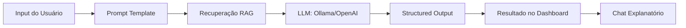

# 🛡️ IA-Phishing — Detector Multimodal de Phishing com IA

O **IA-Phishing** é um sistema avançado de detecção de fraudes digitais que utiliza inteligência artificial multimodal para analisar links, e-mails, código HTML e imagens. O projeto foca em **portabilidade** (IA Local) e **explicabilidade**, ajudando o usuário a entender por que um conteúdo foi classificado como malicioso.

---

## 🎯 Descrição do Problema e Solução

### Problema
O phishing moderno é complexo. Atacantes não usam apenas URLs falsas; eles usam engenharia social agressiva, sites com design idêntico ao real e técnicas de obscurecimento de código. Analisadores simples de URL falham ao ignorar o contexto visual e textual.

### Solução
Nossa solução implementa uma **Arquitetura Multi-Agente**. Ao processar um input, o sistema dispara múltiplos agentes especializados (Léxico, SSL, NLP e Visão) que trabalham em paralelo. O resultado é consolidado por um orquestrador que gera um veredito baseado em pesos ponderados e fornece um chat interativo para tirar dúvidas técnicas.

---

## 🧠 Arquitetura de LLM

O fluxo de processamento segue o padrão moderno de engenharia de LLM:

1.  **Input**: URL, Texto, HTML ou Imagem.
2.  **Orquestrador**: Divide a tarefa entre agentes.
3.  **Prompt & RAG**: Agentes NLP e Chat injetam conhecimento técnico da base de dados local via VectorStore.
4.  **Modelos**: O sistema decide entre usar **IA Local (Privacidade)** ou **IA Cloud (Potência)**.
5.  **Structured Output**: Usamos Pydantic para garantir que o modelo responda EXATAMENTE no formato que o sistema espera.

---

## 🛠️ Decisões de Engenharia e Justificativas

| Decisão | Escolha | Justificativa |
|---------|---------|---------------|
| **Framework** | **LangChain** | Abstração poderosa para trocar de provedor de IA (Ollama/OpenAI) sem refatorar o backend. Suporte nativo para RAG e Cadeias de Chat. |
| **Modelos** | **Híbrido (Qwen/GPT-4o)** | Usamos modelos locais de 0.5B para rapidez e privacidade em texto. Usamos GPT-4o para visão devido à superioridade na análise de imagens. |
| **Temperatura** | **0.0** | Em segurança, a "criatividade" é um risco. Precisamos de respostas determinísticas e técnicas; a mesma evidência deve gerar o mesmo veredito. |
| **Prompting** | **Chain-of-Thought** | Prompts estruturados que guiam a IA a analisar primeiro o "O que" (fatos) e depois o "Por que" (razão) antes do "Veredito" (decisão). |
| **Tools** | **Pydantic Parser** | Tratamos a saída estruturada da IA como a ferramenta principal de integração com o banco de dados SQLite. |

---

## ✅ O que Funcionou
- **Consolidação em Paralelo**: O uso de `ThreadPoolExecutor` reduziu o tempo de análise de 10s para menos de 3s.
- **RAG (Knowledge Base)**: O chat deixou de dar respostas genéricas e passou a citar técnicas reais de phishing encontradas na base de conhecimento.
- **Persistence**: O uso de `localStorage` para manter o tema e o modelo preferido melhorou drasticamente a usabilidade (UX).

## ❌ O que Não Funcionou e Limitações
- **Visão Local em CPUs**: O modelo Llava via Ollama apresentou tempos de resposta de >40s em hardware doméstico, inviabilizando o uso local para imagens (por isso mantivemos GPT-4o para o modo Vision).
- **Falsos Positivos em URLs Curtas**: Links encurtados (bit.ly) às vezes geram scores altos no analisador léxico sem serem maliciosos, exigindo a análise de texto para equilibrar o score.

---

## 🚀 Como Executar
1. Instale o Ollama: `ollama run qwen2.5:0.5b`
2. Instale as dependências: `pip install -r requirements.txt`
3. Inicie o servidor: `python app.py`
4. Acesse: `http://127.0.0.1:7865`

---
> **Aviso Acadêmico**: Este é um projeto educativo. Não deve ser utilizado como única ferramenta de segurança em ambientes de produção.
