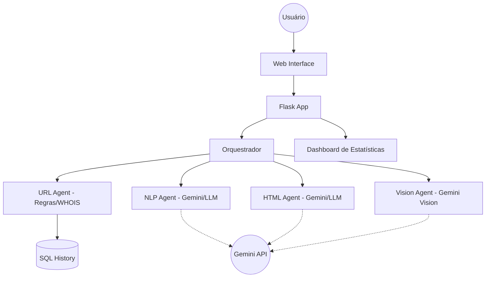

# 🛡️ IA-Phishing — Detector Multimodal de Phishing com IA

[](https://www.python.org/)
[](https://flask.palletsprojects.com/)
[](https://huggingface.co/spaces/janiel01/IA-Phishing)
[](https://www.sqlite.org/)

> **Avaliação Intermediária — IA Generativa (30% da nota final)**  
> Desenvolvido integralmente com auxílio de agente de codificação IA.

🔗 **Endpoint público:** [huggingface.co/spaces/janiel01/IA-Phishing](https://huggingface.co/spaces/janiel01/IA-Phishing)  
📦 **Repositório:** [github.com/Janiel-Gomes/IA-Phishing](https://github.com/Janiel-Gomes/IA-Phishing)

---

## 📋 Índice

- [Descrição do Problema e Solução](#-descrição-do-problema-e-solução)
- [Como a IA Será Integrada no Futuro](#-como-a-ia-será-integrada-no-futuro)
- [Funcionalidades Implementadas](#-funcionalidades-implementadas)
- [Arquitetura e Escolhas de Design](#-arquitetura-e-escolhas-de-design)
- [Estrutura do Projeto](#-estrutura-do-projeto)
- [Tecnologias Utilizadas](#-tecnologias-utilizadas)
- [Configuração e Instalação](#-configuração-e-instalação)
- [O que Funcionou Bem](#-o-que-funcionou-bem)
- [O que Não Funcionou](#-o-que-não-funcionou)
- [Uso do Agente de Codificação](#-uso-do-agente-de-codificação)

---

## 🎯 Descrição do Problema e Solução

### O Problema

O phishing é uma das ameaças cibernéticas mais comuns e perigosas. Milhões de pessoas são vítimas todos os anos de sites falsos que imitam bancos, redes sociais e serviços governamentais para roubar dados pessoais. As ferramentas de detecção existentes geralmente analisam apenas a URL, ignorando outros sinais importantes como o conteúdo textual do e-mail, a estrutura HTML da página e até imagens/capturas de tela.

### A Solução

O **IA-Phishing** é uma plataforma web de **análise multimodal** que combina **4 agentes especializados** para detectar phishing de forma mais completa:

| Agente | O que analisa | Exemplos de detecção |
|--------|--------------|---------------------|
| 🔗 **URL Lexical** | Estrutura da URL | Domínios suspeitos, excesso de subdomínios, IPs no lugar de domínios |
| 📝 **NLP Text** | Conteúdo textual | Palavras de urgência ("sua conta será bloqueada"), links encurtados |
| 💻 **HTML Structural** | Código-fonte HTML | Formulários apontando para domínios diferentes, campos de senha em HTTP |
| 🖼️ **Vision** | Imagens/screenshots | Metadados de imagem, detecção de formatos suspeitos |

Cada agente gera um **score de risco independente**, e um **orquestrador** consolida tudo com pesos ponderados para gerar o veredito final: **Legítima**, **Suspeita** ou **Phishing**.

---

## 🧠 Decisões de Engenharia de LLM

Nesta fase final, o projeto evoluiu de heurísticas simples para uma integração robusta com **IA Generativa (Gemini 1.5 Flash)**. Abaixo estão detalhadas as decisões técnicas tomadas:

### 1. Escolha do Framework e Modelo
- **Framework**: Utilizado o **Google Generative AI SDK** (Python). Optei por chamadas diretas via SDK em vez de LangChain para manter o projeto leve e ter controle total sobre o fluxo de mensagens e tratamento de erros.
- **Modelo**: `gemini-1.5-flash`. Escolhido pelo excelente custo-benefício, baixa latência e capacidade multimodal (essencial para o `VisionAgent`).
- **Parâmetros**: 
  - `temperature: 0.0`: Para garantir respostas determinísticas e técnicas.
  - `top_p: 0.95`: Para manter a coerência sem perder nuances.
  - `response_mime_type: application/json`: Para garantir saídas estruturadas que o backend possa parsear.

### 2. Estratégia de Prompting
- **System Prompt**: Define a persona (Especialista em Cybersecurity) e o esquema de saída JSON obrigatório. Localizado em `prompts/system_prompt.txt`.
- **Chain-of-Thought (implícito)**: Os prompts instruem o modelo a analisar pontos específicos (formulários, urgência, logos) antes de gerar o score final.
- **Structured Outputs**: Uso nativo do Gemini para garantir que cada agente retorne `score`, `result` e `findings` de forma consistente.

### 3. Agentes e Ferramentas
- **Text Agent**: Analisa semântica, tom de voz e intenção do texto.
- **HTML Agent**: Recebe snippets do código fonte para identificar exfiltração de dados e ofuscação.
- **Vision Agent**: Analisa screenshots em busca de brand impersonation e UI suspeita.
- **Fallback Heurístico**: Todos os agentes mantêm uma lógica de fallback baseada em regras caso a API não esteja disponível, garantindo resiliência.

### 4. Trade-offs: Pago vs. Local
- **Por que Gemini (Pago/API)?**: A capacidade de visão multimodal do Gemini 1.5 Flash é superior a modelos locais que caberiam em hardware comum. O tool calling (via JSON mode) é extremamente robusto.
- **Viabilidade de Modelo Local**: Seria possível usar **Ollama** com `Llama-3` ou `Mistral` para os agentes de Texto e HTML. No entanto, perderíamos a facilidade da análise de imagem nativa (necessitaria de modelos Vision-Language locais bem mais pesados) e o deploy no Hugging Face Spaces seria impossível no tier gratuito devido ao consumo de RAM/GPU.

---

## 🏗️ Arquitetura Atualizada



---

## ✨ Funcionalidades Implementadas

### 🔍 Analisador Multimodal (Tela Principal)
- **Barra de entrada unificada** estilo chat com botão "+" para selecionar o tipo de análise
- **4 modos de entrada:** URL, Texto/E-mail, Código HTML e Upload de Imagem
- **Preview de imagem** antes do envio
- **Resultado detalhado** com score de confiança, badge colorido (Legítima/Phishing/Suspeito)
- **Insights por agente** — cada agente mostra seus findings individuais

### 📊 Página de Estatísticas
- **4 KPIs em cards:** Total de Análises, Phishing Detectado, Conteúdo Seguro, Taxa de Detecção
- **Barras de distribuição** animadas mostrando a proporção de cada resultado
- **Timeline** das últimas análises com ícones e cores por tipo

### 🕐 Histórico de Buscas
- **Últimas 10 análises** salvas em SQLite
- **Paginação inteligente:** mostra apenas as 2 mais recentes com botão "Ver Mais"
- **Expansão de detalhes:** clique na seta (▼) para expandir score de confiança e análise completa da IA, com animação suave
- **Estilos premium** para a caixa de detalhe: gradiente sutil, labels com ícone azul e glassmorphism

### 🗂️ Sidebar de Navegação
- Menu lateral com glassmorphism
- Alternância entre "Analisador" e "Estatísticas"
- Botão de fechar (✕) dentro do menu + overlay clicável
- Design responsivo — colapsa em telas menores

### 🔔 Popup Inicial de Aviso
- Modal com animação elástica ao abrir o site
- Explica que o projeto é acadêmico e não deve ser usado para fins de segurança reais
- Fecha ao clicar no botão ou no overlay

---

## 🏗️ Arquitetura e Escolhas de Design

### Por que Flask (e não FastAPI/Gradio)?

Flask foi escolhido por:
1. **Flexibilidade total** no design da UI — sem limitações de componentes pré-prontos
2. **Servir templates HTML** nativamente com Jinja2
3. **Simplicidade** — um único `app.py` serve backend, API e frontend
4. **Compatibilidade** com uploads de arquivos e FormData multipart

### Por que arquitetura Multi-Agente?

Em vez de um único modelo monolítico, optei por agentes especializados porque:
1. **Modularidade** — cada agente pode ser desenvolvido e substituído independentemente
2. **Explicabilidade** — o usuário vê exatamente quais sinais cada agente detectou
3. **Escalabilidade** — novos agentes podem ser adicionados sem mudar a interface
4. **Pesos configuráveis** — o orquestrador combina os scores com pesos ajustáveis

```
URL Lexical (25%) ──┐
NLP Text (35%)   ───┤──▶ Orquestrador ──▶ Veredito Final
HTML Struct (25%) ──┤
Vision (15%)     ───┘
```

### Por que SQLite?

- Não exige instalação de servidor de banco de dados
- Um único arquivo `.db` — portátil e simples
- Python já tem suporte nativo
- Suficiente para o escopo do protótipo

### Por que Hugging Face Spaces para deploy?

- **Link permanente** sem precisar manter ngrok rodando
- **Gratuito** com CPU básico suficiente para Flask
- **Docker nativo** — total controle do ambiente
- **Integração fácil** via upload de arquivos ou git

### Escolhas de UI/UX

- **Glassmorphism** — estilo visual moderno com transparências e blur
- **Design claro** com acentos em azul — transmite confiança e segurança
- **Input unificado estilo "chat"** — inspirado em interfaces modernas de IA (ChatGPT, Claude)
- **Responsivo** — sidebar colapsável, layout adaptável para mobile

---

## 📁 Estrutura do Projeto

```
IA-Phishing/
├── Dockerfile                # Configuração para deploy no HF Spaces
├── app.py                    # Servidor Flask, rotas API e banco de dados
├── requirements.txt          # Dependências Python (apenas essenciais)
├── phishing_history.db       # Banco SQLite (gerado automaticamente)
│
├── agents/                   # Módulo de agentes de análise
│   ├── __init__.py
│   ├── orchestrator.py       # Orquestrador — combina resultados dos agentes
│   ├── url_agent.py          # Agente de análise lexical de URLs
│   ├── text_agent.py         # Agente de análise NLP (heurísticas)
│   ├── html_agent.py         # Agente de análise estrutural de HTML
│   └── vision_agent.py       # Agente de análise de imagens
│
├── templates/
│   └── index.html            # Template principal (Analisador + Estatísticas + Popup)
│
└── static/
    ├── style.css             # Estilos customizados (630+ linhas)
    └── script.js             # Lógica frontend (450+ linhas)
```

---

## 🚀 Tecnologias Utilizadas (Atualizado)

| Camada | Tecnologia |
|--------|-----------|
| **LLM Interface** | Gemini SDK, `google-generativeai` |
| **Ambiente** | `python-dotenv` para gestão de chaves |
| **Backend/UI** | Flask, SQLAlchemy, Bootstrap |
| **Parsing** | BeautifulSoup4, regex |

---

## 🛠️ Configuração e Instalação

### Adicionando a Chave de API
Para que o detector funcione com IA real:
1. Crie um arquivo `.env` na raiz do projeto.
2. Adicione sua chave: `GEMINI_API_KEY=sua_chave_aqui`

### Passo a Passo
```bash
# 1. Instalar novas dependências
pip install -r requirements.txt

# 2. Rodar a aplicação
python app.py
```

A aplicação estará disponível em `http://localhost:7860`

### Endpoint Público

Acesse diretamente em: **https://janiel01-ia-phishing.hf.space**

---

## ✅ O que Funcionou Bem

### 1. Geração da Arquitetura Multi-Agente
O agente entendeu o conceito de múltiplos agentes especializados com um orquestrador central. Em um único prompt, gerou a estrutura completa dos 4 agentes e o `orchestrator.py` com o sistema de pesos ponderados.

**Exemplo de prompt efetivo:**
> "Evolua meu projeto para um sistema multi-agente com agentes especializados em URL, NLP, HTML e Visão, orquestrados por um agente central que consolida os resultados com pesos ponderados."

### 2. Interface Glassmorphism Completa
O agente gerou todo o CSS (630+ linhas) com o tema claro + glassmorphism sem intervenção manual. Os efeitos de blur, transparência e animações de hover ficaram profissionais desde a primeira versão.

### 3. Página de Estatísticas
Ao pedir "gere a página de estatísticas", o agente criou de uma só vez o endpoint `/stats`, os 4 cards KPI, as barras animadas, a timeline e a navegação entre páginas.

### 4. Persistência com SQLite
A integração Flask-SQLAlchemy foi gerada corretamente, incluindo o modelo `ScannedURL`, a criação automática do banco e o endpoint `/history` — tudo funcional sem ajustes.

### 5. Deploy no Hugging Face Spaces
O agente gerou o `Dockerfile` correto e identificou que a porta deveria ser `7860`. O deploy foi concluído com sucesso rapidamente.

### 6. Iteração Incremental
A estratégia de construir incrementalmente (estrutura → agentes → UI → refinamentos → deploy) funcionou muito bem. Cada iteração adicionava funcionalidade sem quebrar o que já existia.

---

## ❌ O que Não Funcionou

### 1. Bug de Referência JavaScript (`navAnalyzer`)
Após uma refatoração, o botão "Analisador" parou de funcionar. O agente havia renomeado o ID no HTML mas não atualizou todas as referências no JavaScript, gerando `ReferenceError`.

**Como foi resolvido:** Adicionado guard `if (navAnalyzer)` para proteger contra referências nulas.

### 2. Sidebar que Não Fechava
O botão de toggle da sidebar ficava **atrás da sidebar** quando ela abria.

**Como foi resolvido:** Adicionado botão de fechar (✕) dentro da sidebar e overlay clicável.

### 3. Desalinhamento de Larguras
A barra de input (700px) e o histórico (800px) tinham `max-width` diferentes. **Resolvido:** Unificados para `800px`.

### 4. Função de Toggle do Histórico Não Definida
O HTML dinâmico dos cards chamava `toggleHistoryDetail(index)` via `onclick`, mas a função nunca havia sido declarada no `script.js`. Clicar na seta não produzia nenhum efeito.

**Como foi resolvido:** Implementada a função no escopo global via `window.toggleHistoryDetail = function(index)`.

**Aprendizado:** Funções chamadas via `onclick` em HTML gerado dinamicamente devem ser declaradas no escopo global.

### 5. Erro de Deploy — `ModuleNotFoundError: transformers`
O `text_agent.py` importava `from transformers import pipeline`, mas a biblioteca foi removida do `requirements.txt` para agilizar o build no HF Spaces.

**Como foi resolvido:** O agente reescreveu o `text_agent.py` para usar análise heurística pura (regex, palavras-chave, padrões de urgência) sem dependências externas pesadas.

### 6. Upload Acidental da Pasta `.venv`
No primeiro upload para o HF Spaces, a pasta `.venv` (36.720 arquivos) foi incluída acidentalmente.

**Como foi resolvido:** A operação foi cancelada e o upload foi refeito selecionando apenas os arquivos necessários.

### 7. VisionAgent Básico
O agente de visão verifica apenas metadados básicos da imagem. Não há OCR nem análise visual real.

**Razão:** Manter o protótipo leve. A integração com modelos de visão está planejada para a próxima fase.

---

## 🤖 Uso do Agente de Codificação

### Ferramenta Utilizada
**Gemini (Antigravity)** — agente de codificação integrado ao VS Code, com acesso direto ao filesystem, terminal e navegador.

### Processo de Desenvolvimento

| Fase | O que foi pedido ao agente | Resultado |
|------|--------------------------|-----------| 
| **1. Setup** | "Analise o projeto e me diga como rodar" | Identificou estrutura Flask, dependências e porta |
| **2. Multi-Agente** | "Evolua para sistema multi-agente com URL, NLP, HTML e Vision agents" | Gerou 5 arquivos Python completos |
| **3. Histórico** | "Implemente busca recente com SQLite" | Criou modelo, endpoint e rendering no frontend |
| **4. UI Unificada** | "Crie interface unificada estilo chat com menu +" | Refatorou completamente o frontend (HTML + CSS + JS) |
| **5. Bug Fix** | "O botão analisador não funciona" (screenshot) | Diagnosticou ReferenceError e corrigiu |
| **6. Alinhamento** | "Alinhe a largura do input com o histórico" | Ajustou max-width de 700px→800px |
| **7. Paginação** | "Mostre apenas 2 itens com botão Ver Mais" | Implementou paginação com toggle |
| **8. Estatísticas** | "Gere a página de estatísticas" (screenshot) | Criou endpoint + HTML + CSS + JS completos |
| **9. Sidebar** | "Adicione botão para abrir/fechar menu lateral" | Adicionou toggle + close button |
| **10. Bug Fix Histórico** | "Clico na seta mas não aparece o texto" | Diagnosticou `toggleHistoryDetail` ausente e implementou |
| **11. Estilo Histórico** | "Deixe essas caixas de textos mais bonitas" | Adicionou 70+ linhas de CSS premium |
| **12. Popup Aviso** | "Adicione popup inicial explicando que é projeto de teste" | Gerou modal com glassmorphism e animação elástica |
| **13. Deploy HF Spaces** | "Quero subir no Hugging Face Spaces" | Gerou Dockerfile, ajustou porta e orientou o deploy |
| **14. Bug Deploy** | "Erro: No module named 'transformers'" | Reescreveu `text_agent.py` com heurísticas puras |

### Extensão do Uso

- **~95% do código foi gerado pelo agente**, incluindo todo o CSS, JavaScript, HTML e a maior parte do Python
- **Intervenção manual** limitou-se a aprovações de comandos e feedback visual (screenshots)
- O agente fez **planning → implementation → verification** em ciclos estruturados
- Quando encontrou bugs, o agente usou screenshots do navegador para diagnosticar

### Exemplos de Prompts Efetivos

```
✅ "Evolua meu projeto para um sistema multi-agente com agentes 
especializados em URL, NLP, HTML e Visão"
→ Resultado: Gerou toda a arquitetura em uma iteração

✅ "Gere a página de estatísticas agora" + screenshot de referência
→ Resultado: Criou backend + frontend de uma vez

✅ "Consigo subir no Hugging Face Spaces?"
→ Resultado: Gerou Dockerfile, explicou o processo e acompanhou o deploy
```

### Exemplos de Prompts que Precisaram de Iteração

```
⚠️ "Adicione botão para abrir/fechar menu lateral"
→ Problema: Primeira versão não permitia fechar a sidebar
→ Solução: Após feedback visual, adicionou botão ✕ dentro da sidebar

⚠️ Deploy no HF Spaces
→ Problema: Import de transformers causou ModuleNotFoundError
→ Solução: Agente reescreveu o agente NLP com heurísticas puras
```

---

## 📄 Licença

Este projeto está sob a licença MIT. Veja o arquivo [LICENSE](LICENSE) para detalhes.

---

**Desenvolvido por Janiel Gomes** — Avaliação Final, Disciplina de IA Generativa, 2026.
